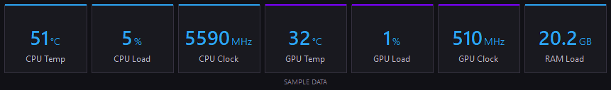

# DLB Precision Monitor

A compact Windows 11 hardware widget in DLBPrecision blue and purple. Designed to stay on another monitor while you play; it does not inject into games.



Appearance preview with sample data. The widget also supports a resizable vertical layout.

## Install

Download `DLB-Precision-Monitor-0.1.0-Setup.exe` from the [v0.1.0 pilot release](https://github.com/dlbprecision/dlb-precision-monitor/releases/tag/v0.1.0) and run it normally (double-click). Access requires an account with permission to this private repository. A SHA256 checksum file accompanies the installer.

Accept Windows administrator approval for setup. The installer includes the signed PawnIO hardware-access setup if needed, the sensor service, and the widget. Windows 11 already contains the .NET Framework runtime it uses. Local builds produce the same installer filename under `artifacts/installer/`.

The current private pilot's DLB installer and application are unsigned. The bundled PawnIO driver installer keeps its original publisher signature. A DLB signing identity and broader clean-PC testing are release work before customer distribution.

## Use

- Drag the widget to the desired monitor. Drag any edge/corner to resize.
- Right-click for settings, horizontal/vertical layout, position/size locking, recovery to the primary screen, or Exit.
- Default show/hide shortcut: **Ctrl+Alt+F10**. Change it in Settings by selecting the shortcut field and pressing a new combination, then Apply. Conflicts and reserved keys are rejected.
- One Celsius/Fahrenheit switch changes both temperatures.
- RAM shows physical memory used, with one decimal place and no total.
- Settings offers 1-second and 2-second refresh, 30–100% opacity, graphics-card selection, launch at sign-in, and small optional branding.
- Hiding the widget stops its sensor polling. Exit ends the widget; the sensor service remains idle until a widget requests readings.
- The tray icon recovers a hidden/locked widget. Reopening the app also restores the existing instance.

The monitor saves position, dimensions, layout, units, branding, opacity, GPU selection, and shortcut in `%LOCALAPPDATA%\DLBPrecision\Monitor\settings.json`. A disconnected display is handled by moving the widget into an available working area. Startup is a per-user Windows Run entry.

## Readings

CPU temperature is package/die temperature with a documented fallback for supported processors. CPU usage is Windows busy time across logical processors. CPU clock is the arithmetic mean of reported core clocks, not bus clock or a claim of maximum boost. GPU temperature, load, and clock refer to the selected GPU's core. Physical RAM used is total minus available, divided by 2^30 (Windows-style GB).

Different tools may use different sensor definitions or sampling intervals. Missing or invalid values display a dash; a stopped/unreachable service never leaves old values looking live. Hover or open Settings for sensor details. See `src/DlbPrecision.Sensors/README.md` for selection rules.

## Implementation

- .NET Framework 4.8, x64; custom-drawn Windows Forms surface, no browser engine.
- `DlbPrecision.Monitor`: per-user widget; never needs elevation for normal operation.
- `DlbPrecision.Service`: `DlbPrecisionSensors` Windows service, running as LocalSystem for sensor access.
- `DlbPrecision.Sensors`: embedded LibreHardwareMonitorLib 0.9.6 with only CPU/GPU monitoring enabled, plus native Windows CPU/RAM metrics. Library sensor history is disabled.
- `DlbPrecision.Shared`: small local output-only named-pipe protocol. The widget authenticates the server PID against SCM. No network connection, file path, or command is accepted from the widget. Several clients share at most one sample per second.

## Build and check

On a Windows development machine with a .NET SDK:

```powershell
dotnet build DlbPrecision.sln -c Release
.\scripts\Test.ps1
.\scripts\Test.ps1 -Integration # Requires installed sensor service
.\scripts\Build-Installer.ps1
```

The build script pins and verifies downloaded build tools and driver payloads. It includes dependency license notices, exact versions, hashes, and required source material. It does not install the app. See `installer/README.md`.

Useful diagnostic commands:

```powershell
.\src\DlbPrecision.Probe\bin\Release\net48\DlbPrecision.Probe.exe --sample
.\src\DlbPrecision.Probe\bin\Release\net48\DlbPrecision.Probe.exe --report
.\src\DlbPrecision.Monitor\bin\Release\net48\DlbPrecision.Monitor.exe --render-preview .\artifacts\preview
```

Preview images are labeled SAMPLE DATA; they are appearance references, not live readings. An unelevated standalone probe can lack CPU temperature/clock even when the installed service has access.

For accessibility/UI testing only, `--test-window` exposes the otherwise taskbar-hidden widget to native test tools. Regular launches omit this switch. `--reset-position` recovers saved offscreen placement.

## Uninstall

Use Windows Settings > Apps > Installed apps > DLB Precision Monitor. The widget, service, and matching startup entries in loaded user profiles are removed. User display preferences remain for reinstall. Shared PawnIO is retained because other applications may use it; its separate removal is described in the installer notes.

## Validation status

See `docs/VALIDATION.md` for evidence and remaining pilot checks. Measurements describe the tested PC and workload; they are not universal performance guarantees.
