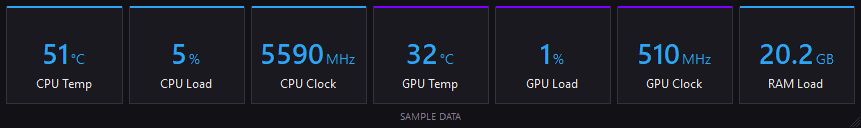

# DLB Precision Monitor

A compact Windows 11 hardware widget in DLBPrecision blue and purple. Designed to stay on another monitor while you play; it does not inject into games.



Appearance preview with sample data. The widget also supports a resizable vertical layout.

## Install

**[Download DLB Precision Monitor for Windows 11](https://github.com/dlbprecision/dlb-precision-monitor/releases/download/v0.1.9/DLB-Precision-Monitor-0.1.9-Setup.exe)**

**v0.1.9 makes Check for updates ready for everyone:** the update window opens in front of Settings, fits its text at every Windows display scaling, and explains clearly when an update can't run. Later versions install from inside the monitor after it verifies they are signed by DLB Precision, LLC. It keeps the v0.1.7 fixes (no flashing box, true 1-second refresh, 50–150% size). Setup, the uninstaller and DLB's application files carry DLB Precision, LLC signatures and timestamps. This is a pilot release, with broader hardware testing still in progress. No GitHub account is needed. Download only the setup EXE; the `.sha256` file on the [release page](https://github.com/dlbprecision/dlb-precision-monitor/releases/tag/v0.1.9) is an optional checksum, not another installer.

1. Download the setup using the link above. If your browser says it **isn't commonly downloaded**, open its Downloads list and choose **Keep** / **Keep anyway**, if offered, for this DLB download.
2. Double-click the downloaded setup. If Windows says **Windows protected your PC** and describes an **unrecognized app**, choose **More info**, then **Run anyway**, only if you trust this official DLB pilot download.
3. Check that the Windows administrator prompt names **DLB Precision, LLC**, choose **Yes**, then follow setup. The single installer includes the widget, sensor service, application libraries, and signed PawnIO setup if needed; no separate hardware-monitoring program or driver download is required. A desktop shortcut is selected by default on fresh installations.

**Updating from the monitor (v0.1.8 and later):** right-click the monitor, or
open **Settings**, and choose **Check for updates…**. If a newer version is
available, its notes are shown; choose **Update now**. The monitor downloads the
update, confirms it is genuinely signed by DLB Precision, LLC, and installs it.
If Windows asks for permission, choose **Yes**. The monitor closes and reopens on
the new version with your settings, size and position kept, including whether
it launches at sign-in. It checks only when you ask, and only then contacts
GitHub. From v0.1.9 on, if another Windows user on the same PC also has the
monitor open, the update waits, because Windows can't close another user's
program: close it there (or sign that user out), then choose **Try again**.

On **v0.1.8**, the update window can open hidden behind Settings. If nothing
seems to happen after **Check for updates…** in Settings, choose **Apply** if
you changed anything (closing Settings discards unapplied changes), then close
Settings: the update window is behind it. (Next time, close Settings first, then
use **Check for updates…** in the right-click menu.) If v0.1.8 reports that
the update "didn't finish (code 21)", the update is installed but the sensor
service needs a Windows restart.

**Updating from v0.1.7 or earlier, or by hand:** download the current setup EXE
above, right-click the monitor and choose **Exit**, then run the new setup. There
is no need to uninstall first. Setup upgrades the existing installation and keeps
your saved settings. Afterward, open the monitor from the Start menu or its
desktop shortcut, or leave **Open DLB Precision Monitor** ticked on setup's last
page.

If setup requests a Windows restart before it can finish the driver step, restart
and run the same DLB installer again. Working shared PawnIO installations are
preserved. Setup does not automatically downgrade a detected newer shared driver.

These instructions apply to reputation warnings. If Windows names a virus or threat, or provides no **Run anyway** option, stop and send DLB the exact message. Keep Windows Security enabled.

A publisher signature identifies DLB; it does not guarantee immediate SmartScreen trust, so new downloads may still show reputation warnings. The bundled PawnIO installer retains its original signature. Broader clean-PC and hardware testing remain required before general customer distribution. [Microsoft explains these reputation warnings](https://learn.microsoft.com/en-us/windows/apps/package-and-deploy/smartscreen-reputation).

The earlier [v0.1.0 pilot](https://github.com/dlbprecision/dlb-precision-monitor/releases/tag/v0.1.0) remains available as an unsigned historical release. [v0.1.1](https://github.com/dlbprecision/dlb-precision-monitor/releases/tag/v0.1.1) was the first publisher-signed pilot, [v0.1.2](https://github.com/dlbprecision/dlb-precision-monitor/releases/tag/v0.1.2) added the widget size slider, and [v0.1.3](https://github.com/dlbprecision/dlb-precision-monitor/releases/tag/v0.1.3) fixed clipped Settings text. These releases retain their original downloads and checksums.

Windows 11 already contains the .NET Framework runtime this app uses. Local builds place the installer under `artifacts/installer/`.

## Use

- Right-click the widget, open **Settings**, move the **Widget size** slider from **50% to 150%**, then click **Apply**. The whole widget scales evenly, including its borders and footer, in horizontal and vertical layouts, and the resulting dimensions are saved.
- For a custom shape, unlock position/size and drag any edge or corner. Applying unrelated settings preserves those custom dimensions unless you request a size or layout change.
- Drag the unlocked widget to the desired monitor. Position/size locking prevents dragging and edge/corner resizing.
- Right-click for settings, horizontal/vertical layout, position/size locking, recovery to the primary screen, or Exit.
- Default show/hide shortcut: **Ctrl+Alt+F10**. Change it in Settings by selecting the shortcut field and pressing a new combination, then Apply. Conflicts and reserved keys are rejected.
- One Celsius/Fahrenheit switch changes both temperatures.
- RAM shows physical memory used, with one decimal place and no total.
- Settings offers 1-second and 2-second refresh, 30–100% opacity, graphics-card selection, launch at sign-in, and small optional branding.
- Hiding the widget stops its sensor polling. Exit ends the widget; the sensor service remains idle until a widget requests readings.
- **Check for updates…** in the right-click menu or in Settings updates the monitor in place; see Updating above.
- The tray icon recovers a hidden/locked widget. Reopening the app shows the existing widget where you left it; use **Move to primary monitor** to bring it to the main display.
- Showing the widget with the shortcut, at sign-in, or by reopening the app never takes keyboard focus from a game.
- If something unexpected fails, the widget keeps running and records the details in `%LOCALAPPDATA%\DLBPrecision\Monitor\error.log`.

The monitor saves position, dimensions, layout, units, branding, opacity, GPU selection, and shortcut in `%LOCALAPPDATA%\DLBPrecision\Monitor\settings.json`. A disconnected display is handled by moving the widget into an available working area. Startup is a per-user Windows Run entry.

## Readings

CPU temperature is package/die temperature with a documented fallback for supported processors. CPU usage is Windows busy time across logical processors. CPU clock is the arithmetic mean of reported core clocks, not bus clock or a claim of maximum boost. GPU temperature, load, and clock refer to the selected GPU's core. Physical RAM used is total minus available, divided by 2^30 (Windows-style GB).

Different tools may use different sensor definitions or sampling intervals. Missing or invalid values display a dash; a stopped/unreachable service never leaves old values looking live. Hover or open Settings for sensor details. See `src/DlbPrecision.Sensors/README.md` for selection rules.

## Implementation

- .NET Framework 4.8, x64; custom-drawn Windows Forms surface, no browser engine.
- `DlbPrecision.Monitor`: per-user widget; never needs elevation for normal operation.
- `DlbPrecision.Service`: `DlbPrecisionSensors` Windows service, running as LocalSystem for sensor access.
- `DlbPrecision.Sensors`: embedded LibreHardwareMonitorLib 0.9.6 with only CPU/GPU monitoring enabled, plus native Windows CPU/RAM metrics. Library sensor history is disabled.
- `DlbPrecision.Updater`: separate updater, started only by **Check for updates…**. It makes one HTTPS request for this repository's GitHub **Latest** release, downloads the setup and its checksum, and runs setup only after verifying the checksum and that Windows trusts a timestamped signature from DLB Precision, LLC of Arkansas, US, issued through Microsoft's identity-verified signing chain, on a file that is the DLB Precision Monitor setup for that version. It never offers drafts, pre-releases or older versions. The widget and sensor service contain no network code.
- `DlbPrecision.Shared`: small local output-only named-pipe protocol. The widget authenticates the server PID against SCM. No network connection, file path, or command is accepted from the widget. Widgets that ask at nearly the same moment share one sample, and every 1-second refresh receives new readings.

## Build and check

On a Windows development machine with a .NET SDK:

```powershell
dotnet build DlbPrecision.sln -c Release
.\scripts\Test.ps1
.\scripts\Test.ps1 -Integration # Requires installed sensor service
.\scripts\Test-Installer.ps1 # Compiled prerequisite scenarios; no driver changes
.\scripts\Build-Installer.ps1 -Version 0.1.9 -OutputDirectory .\artifacts\unsigned-0.1.9-attempt-1
```

The build script pins and verifies downloaded build tools and driver payloads. It includes dependency license notices, exact versions, hashes, and required source material. It does not install the app. The command above makes an **unsigned local build**; release signing is opt-in and requires DLB's approved signing profile. See [installer build instructions](installer/README.md) and [code-signing instructions](docs/CODE-SIGNING.md). Use a new output directory for each attempt; existing installer files and checksums are never overwritten.

Useful diagnostic commands:

```powershell
.\src\DlbPrecision.Probe\bin\Release\net48\DlbPrecision.Probe.exe --sample
.\src\DlbPrecision.Probe\bin\Release\net48\DlbPrecision.Probe.exe --report
.\src\DlbPrecision.Monitor\bin\Release\net48\DlbPrecision.Monitor.exe --render-preview .\artifacts\preview
```

Preview images are labeled SAMPLE DATA; they are appearance references, not live readings. An unelevated standalone probe can lack CPU temperature/clock even when the installed service has access.

### Releasing an update

In-app updates offer only the GitHub release marked **Latest**, and every
installed copy checks it with the rules it was built with. A release that breaks
these rules is silently never offered, so follow this list every time:

1. **Never rename, re-case, transfer, make private or delete** the
   `dlbprecision` account or the `dlb-precision-monitor` repository. Every
   installed copy has `api.github.com/repos/dlbprecision/dlb-precision-monitor`
   compiled in; breaking it strands all of them on their current version until
   someone reinstalls by hand.
2. Commit everything first, then build with `Build-Installer.ps1 -Sign` and a
   three-part `-Version X.Y.Z` (at most 4, 4 and 5 digits). The signed build
   refuses uncommitted changes, prints the commit it was built from, runs the
   new updater's own checks on the finished setup and fails if installed copies
   would refuse it. Release that exact commit: tag it, and later merge it with a
   **merge commit** (not squash or rebase) so the commit recorded in the
   binaries stays on `main`.
   Test builds use `-TestBuild` with a four-part version (for example 0.1.8.9),
   so they sort below the next release and can never be offered as one. Never
   sign a throwaway build with a releasable three-part version.
3. Create the tag **lowercase** `vX.Y.Z` (same X.Y.Z as `-Version`) on the
   build commit from git first, `git tag -a vX.Y.Z <commit the build printed>`
   then `git push origin <branch> vX.Y.Z`, and choose that existing tag in
   GitHub's release form (left to itself, the form tags the default branch).
   Attach both build outputs under their exact names,
   `DLB-Precision-Monitor-X.Y.Z-Setup.exe` and
   `DLB-Precision-Monitor-X.Y.Z-Setup.exe.sha256` (setup under 64 MiB), and
   publish it as a **pre-release** first. Publish before merging a README that
   links to the new download, so the link never points at a missing file. Never
   replace the assets of a release once published; fix problems with a new
   version.
4. Write the release notes for people reading them inside the updater: plain
   paragraphs without hard line breaks, no "download this setup" steps (the
   updater does that), and manual-install steps only on the README.
5. Try the update from the installed updater with a test feed, for example
   `"C:\Program Files\DLB Precision Monitor\DlbPrecision.Updater.exe" --feed https://api.github.com/repos/dlbprecision/dlb-precision-monitor/releases/tags/vX.Y.Z`.
   A feed only chooses which release to offer; it allows pre-releases and skips
   the download-address rule, but the same tag, file, signature and version
   checks apply. This moves the PC to the new version, so keep the previous
   release's `DlbPrecision.Updater.exe` (in its signed build's `stage-*\app`
   folder) for the next step.
6. Run the go-live check with the updater of **every release still in use**
   (at least v0.1.8, the oldest that updates itself, and the previous release),
   because a copy that skipped releases keeps its own rules. Before marking
   Latest, run the pre-flight against the published pre-release:
   `.\scripts\Check-LatestOffer.ps1 -Updater <older DlbPrecision.Updater.exe> -Feed https://api.github.com/repos/dlbprecision/dlb-precision-monitor/releases/tags/vX.Y.Z -AsIfLatest -ExpectVersion X.Y.Z`.
   Merge the release PR (with a merge commit) before marking Latest, so the
   README on `main` already offers the new download. Then make it Latest: edit
   the release, untick **Set as a pre-release** (a pre-release can't be Latest)
   and tick **Set as the latest release**, or run
   `gh release edit vX.Y.Z --prerelease=false --latest`. Check that
   `/releases/latest` returns it, wait a minute, and run the go-live check again
   without `-Feed` and `-AsIfLatest`. Each run must print two PASS lines
   (offered, and verified after a real download). "You're up to date" in the
   window is not a go-live check.
7. To pull a release back, make the **previous good release** Latest rather
   than only marking the bad one as a pre-release: edit it, untick **Set as a
   pre-release** (a pre-release can't be Latest), tick **Set as the latest
   release** and save. Check that `/releases/latest` now returns it, and point
   the README download link back to it. With no Latest release at all, v0.1.9
   and later report an error on every check.

`DlbPrecision.Updater.exe --render-preview <folder>` saves pictures of each
updater screen.

For accessibility/UI testing only, `--test-window` exposes the otherwise taskbar-hidden widget to native test tools. Regular launches omit this switch. `--reset-position` recovers saved offscreen placement.

## Uninstall

Use Windows Settings > Apps > Installed apps > DLB Precision Monitor. The widget, service, and matching startup entries in loaded user profiles are removed. User display preferences remain for reinstall. Shared PawnIO is retained because other applications may use it; its separate removal is described in the installer notes.

## Validation status

See `docs/VALIDATION.md` for evidence and remaining pilot checks. Measurements describe the tested PC and workload; they are not universal performance guarantees.
